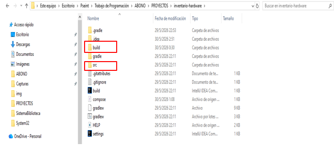
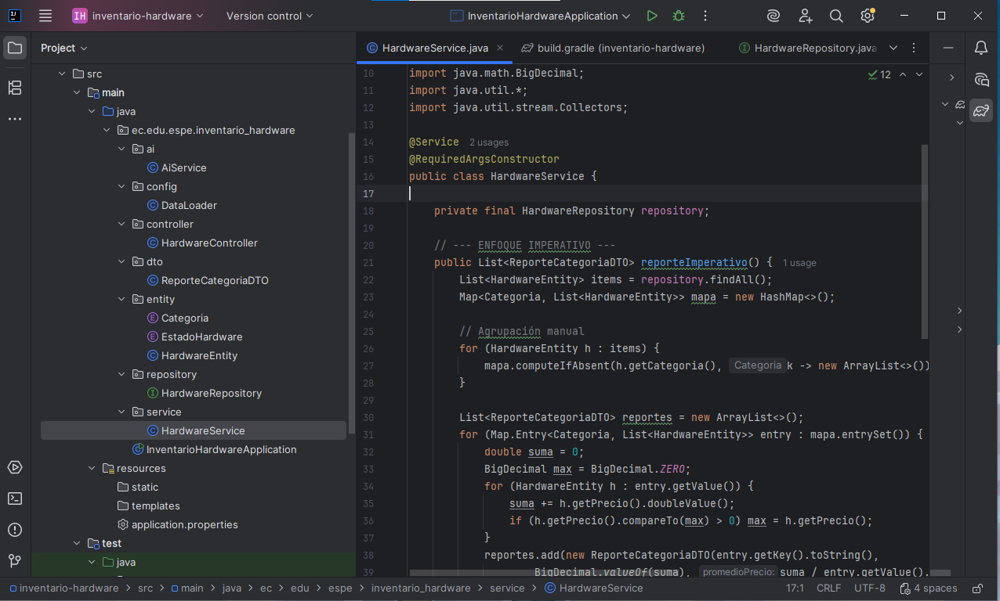

Estos son los directorios principales de un proyecto basado en Gradle: 
src contiene el código fuente de nuestra aplicación, mientras que build almacena automáticamente los archivos generados y compilados tras ejecutar el proyecto.

La capa service contiene la lógica de negocio de la aplicación, donde se procesan y transforman los datos provenientes del repositorio. En este archivo HardwareService.java, se implementan los algoritmos y cálculos necesarios para generar reportes, como el agrupamiento y análisis de hardware por categoría.

La capa repository actúa como el puente de comunicación con la base de datos, permitiendo realizar operaciones de persistencia de forma sencilla. En HardwareRepository.java, al extender JpaRepository, el sistema obtiene automáticamente métodos listos para consultar, guardar o eliminar datos de la entidad HardwareEntity.

