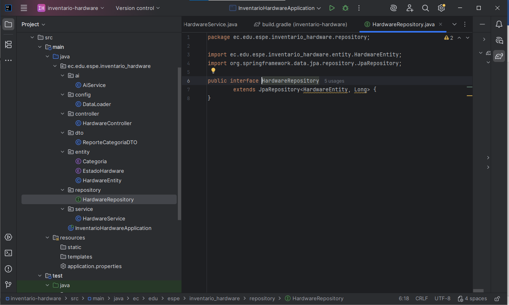
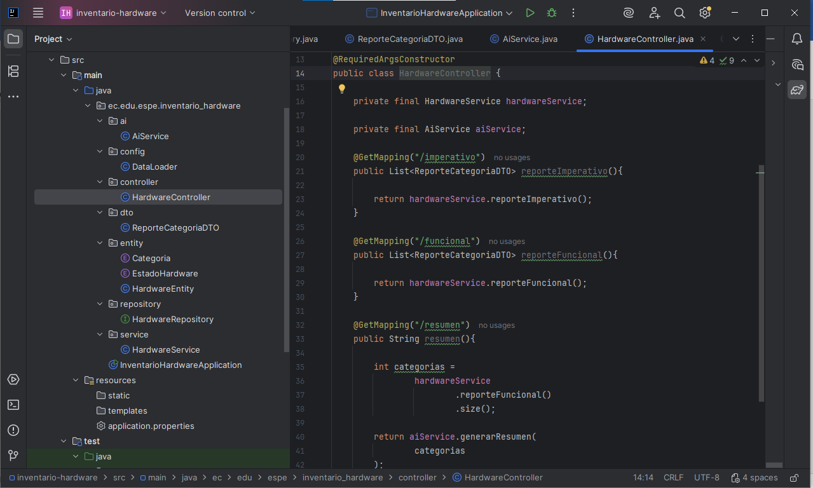
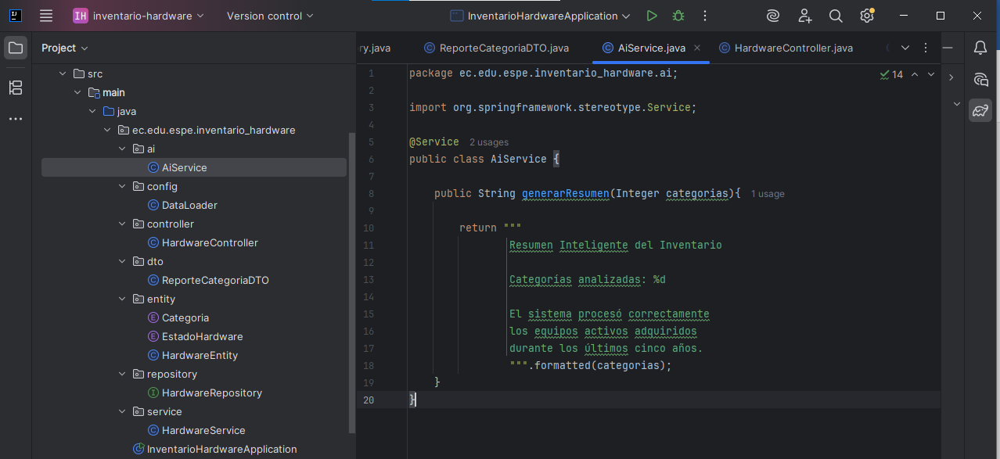
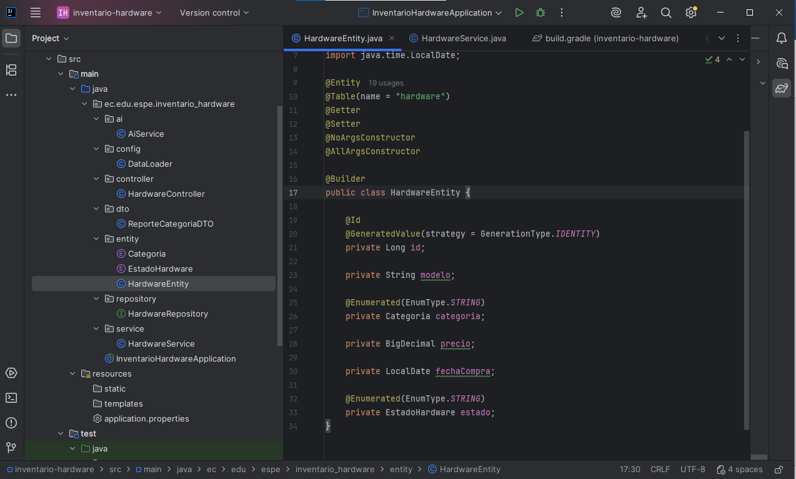
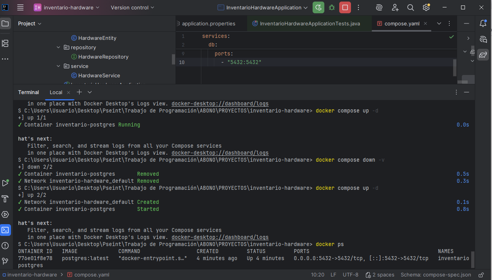
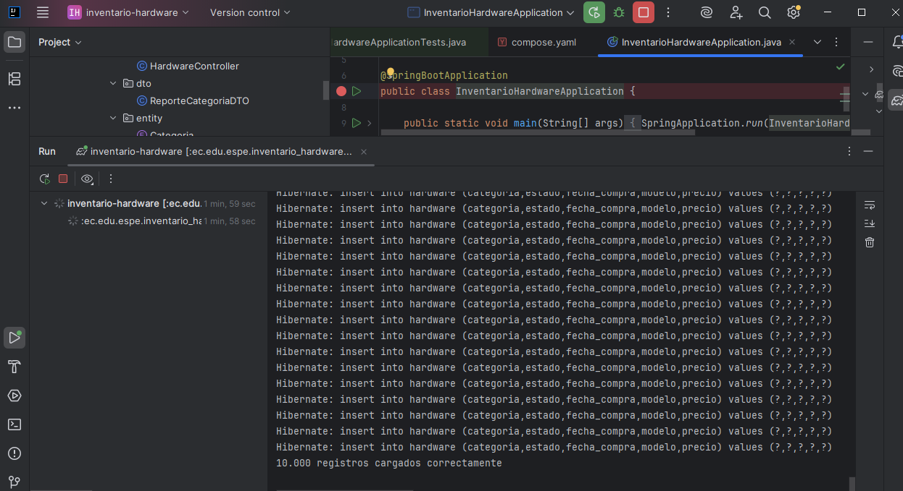
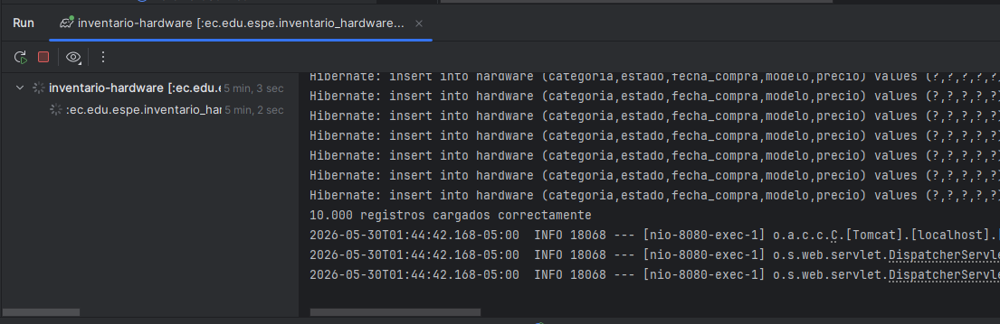
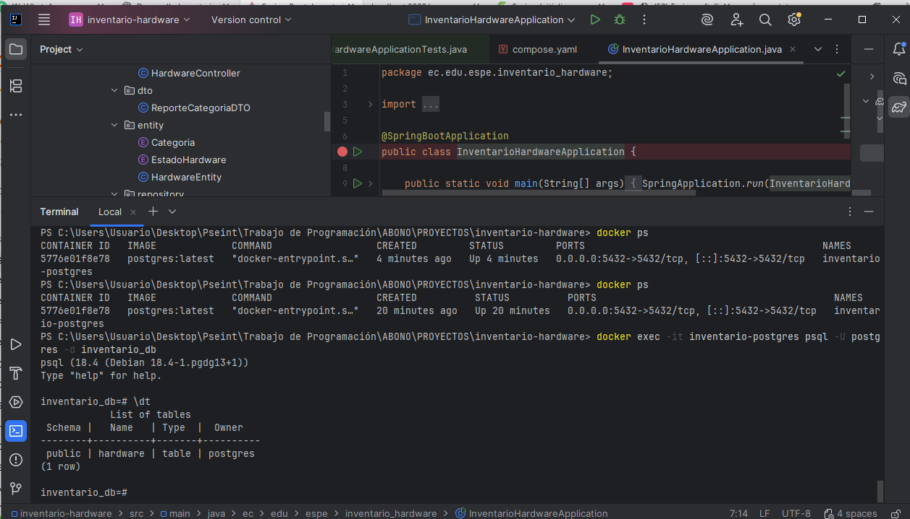

Estos son los directorios principales de un proyecto basado en Gradle: 
src contiene el código fuente de nuestra aplicación, mientras que build almacena automáticamente los archivos generados y compilados tras ejecutar el proyecto.

La capa service contiene la lógica de negocio de la aplicación, donde se procesan y transforman los datos provenientes del repositorio. En este archivo HardwareService.java, se implementan los algoritmos y cálculos necesarios para generar reportes, como el agrupamiento y análisis de hardware por categoría.

La capa repository actúa como el puente de comunicación con la base de datos, permitiendo realizar operaciones de persistencia de forma sencilla. En HardwareRepository.java, al extender JpaRepository, el sistema obtiene automáticamente métodos listos para consultar, guardar o eliminar datos de la entidad HardwareEntity.

La capa controller gestiona las solicitudes HTTP entrantes y define los puntos de acceso (endpoints) de la API. En HardwareController.java, se exponen las funcionalidades del sistema mediante anotaciones @GetMapping, coordinando la interacción entre el cliente y la lógica definida en los servicios.

La capa ai está diseñada para albergar funcionalidades de procesamiento inteligente o análisis avanzado de datos. En este archivo AiService.java, se encapsula la lógica para generar reportes dinámicos y formateados que presentan de forma estructurada los resultados procesados por el sistema.

La capa entity define el modelo de datos de la aplicación, representando las tablas de la base de datos como objetos de Java. En HardwareEntity.java, se establecen las propiedades y reglas de los objetos que el sistema gestiona, como el modelo, precio y estado del hardware.

La ejecución de `docker compose up -d` despliega y levanta en segundo plano los servicios definidos, en este caso, una base de datos PostgreSQL necesaria para la aplicación. El comando final `docker ps` permite verificar que el contenedor (llamado inventario-postgres) esté activo y muestra detalles como su estado, los puertos expuestos y el tiempo de ejecución.

La ejecución del programa muestra cómo Hibernate realiza la inserción masiva de datos en la base de datos PostgreSQL, confirmando al final la carga exitosa de 10,000 registros. Este proceso asegura que el entorno esté correctamente configurado y listo para las operaciones de consulta y análisis de hardware.

La ejecución del programa confirma que el servidor embebido `Tomcat` se ha iniciado correctamente, habilitando el `puerto 8080` para escuchar y gestionar las peticiones web de la aplicación. Esto permite que el sistema esté listo para interactuar con los usuarios y procesar las operaciones de inventario a través de la interfaz web configurada.

La ejecución del comando `docker exec -it inventario-postgres psql -U postgres` permite acceder interactivamente a la consola de PostgreSQL dentro del contenedor, facilitando la administración directa de la base de datos. Al usar el comando `\dt`, el sistema lista las tablas existentes, confirmando exitosamente que la tabla `hardware` ha sido creada y está lista para almacenar la información del proyecto.

